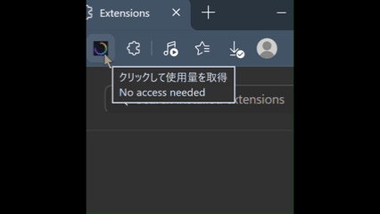

# Gemini Usage Viewer

Google Gemini（gemini.google.com）の現在の使用量と1週間の上限などの情報を取得し、拡張機能のアイコン上に表示するChrome拡張機能です。

*※録画環境の都合上、上の画像にはマウスホバー時のツールチップが含まれていません。実際の動作では、アイコンにカーソルを合わせると「現在の使用量（リセット時間）」と「1週間の上限（リセット時間）」の詳細テキストが表示されます。*

## 主な機能

* **使用量の視覚化**: 拡張機能のアイコンをクリックすると、バックグラウンドでGeminiの使用量を取得し、アイコンのバッジに現在の使用量のパーセンテージを表示します。
* **状態に応じたカラー表示**: 使用量の割合に応じて、バッジの色が緑（50%未満）、黄（50%〜80%）、赤（80%以上）に変化します。
* **詳細情報の確認**: アイコンにカーソルを合わせる（ツールチップ）ことで、以下の情報を確認できます。
  * 現在の使用量とリセット時間
  * 1週間の上限とリセット時間

## プライバシーとセキュリティ

当拡張機能は、ユーザーのプライバシーを尊重し、安全性を最優先に設計されています。

* **完全ローカル処理**: 取得した使用量データは、ブラウザの拡張機能内（ローカル）でのバッジ表示およびツールチップ表示にのみ使用されます。
* **独自サーバー等への送信なし**: 拡張機能が取得データを独自のサーバーや第三者のサーバーへ送信・保存することは一切ありません。
  * *(※データ取得の仕組みとして、実行時に一時的にバックグラウンドの非アクティブタブで `gemini.google.com` へアクセスします)*
* **最小限の権限**: 拡張機能の動作に必要な最小限の権限（`scripting` および 対象ドメインへのアクセス許可）のみを要求します。

## 動作要件

* Googleアカウントにログインし、Geminiの利用権限があること。
* `https://gemini.google.com/usage` ページへ正常にアクセスできるプラン・地域であること。

## インストール方法（開発者モード）

Chrome Web Storeでの公開前、またはソースコードから直接インストールする場合は以下の手順に従ってください。

1. このリポジトリをダウンロード（ZIP）またはクローンし、任意のフォルダに展開します。
2. Google Chromeを開き、アドレスバーに `chrome://extensions/` と入力して拡張機能管理ページを開きます。
3. 画面右上の「デベロッパー モード」をオンにします。
4. 画面左上の「パッケージ化されていない拡張機能を読み込む」をクリックし、手順1で展開したフォルダを選択します。
5. ブラウザのツールバーに本拡張機能のアイコンが追加されます。

## 使い方

1. Geminiにログイン可能な状態でブラウザを使用します。
2. 本拡張機能のアイコンをクリックします。
3. バッジに「...」と表示され、データの取得が開始されます。この時、バックグラウンドでデータ取得用のタブが一時的に開かれます。
4. 取得が完了すると、使用量のパーセンテージがバッジに表示され、作業用のタブは自動的に閉じられます。

## 免責事項と既知の制限（重要）

* **DOM構造への依存**: 本拡張機能は、Gemini（gemini.google.com）のWebページ内の特定のHTML要素（DOM構造）を参照してデータを取得しています。そのため、**Google側によるサイトのUI変更や内部仕様のアップデートが行われた場合、予告なくデータが取得できなくなる（エラー表示になる）可能性があります。**
* **非公式ツール**: 本拡張機能は個人の開発物であり、Google LLCとは一切関係ありません。
* **無保証**: 本ツールの使用により生じた直接的、間接的な損害について、開発者は一切の責任を負いません。

## ライセンス

[MIT License](LICENSE)
